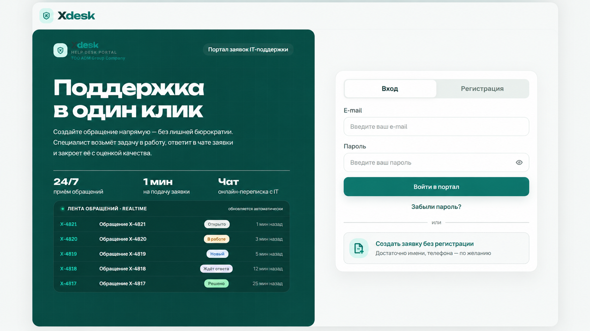
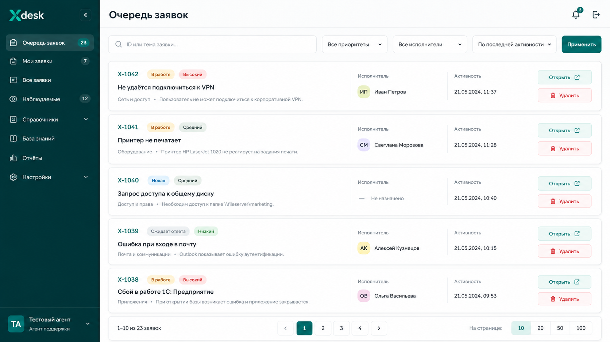
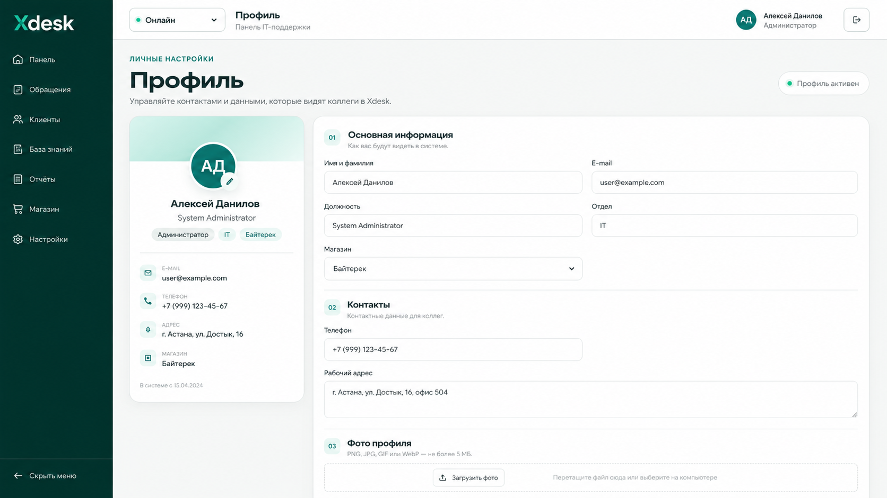
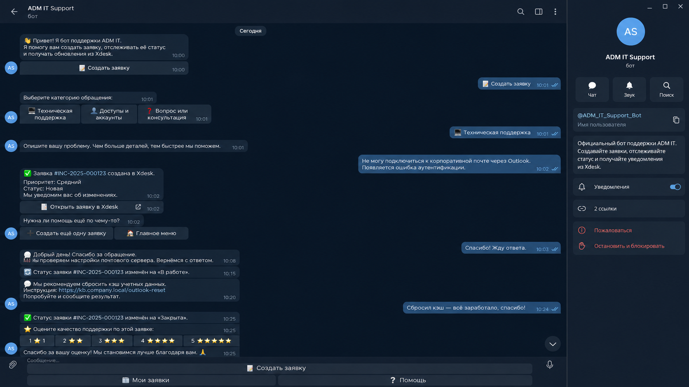
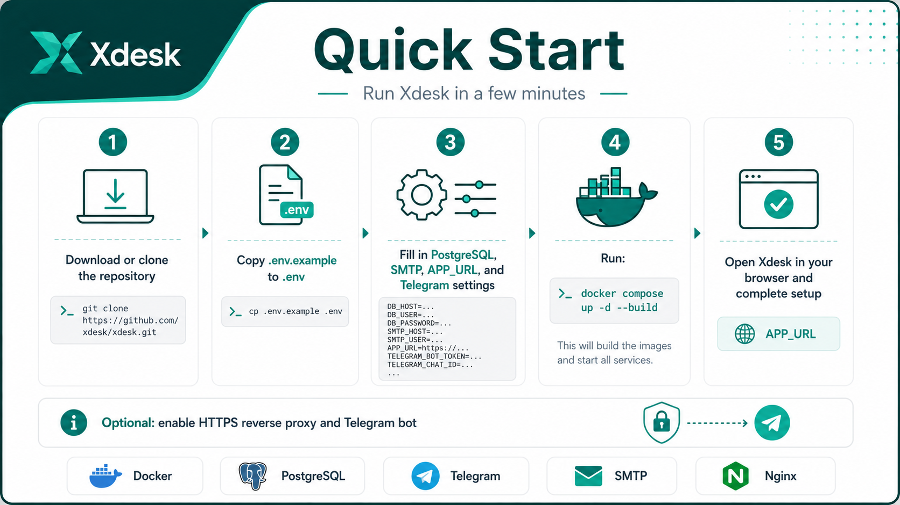

# Xdesk

Self-hosted helpdesk portal for internal IT support with ticket management, role-based access, knowledge base, analytics, file attachments, SMTP password recovery, Docker deployment, and optional two-way Telegram integration.

> This public repository is a clean template. It does **not** contain production passwords, bot tokens, SMTP credentials, TLS private keys, private company accounts, or private deployment IP addresses.

---

## Features

- USER / AGENT / ADMIN roles
- Ticket queue with statuses, priorities, assignees, filters and pagination
- Personal tickets for end users
- Ticket chat between users and support agents
- File attachments in tickets and messages
- Knowledge base
- User management
- Analytics and Excel export
- Password recovery through SMTP
- Telegram bot ticket creation
- Two-way Xdesk ↔ Telegram ticket chat
- Telegram ticket status notifications
- Telegram 1–5 star rating after ticket closure
- PostgreSQL persistence
- Docker Compose deployment
- Optional Nginx reverse proxy
- Optional HTTPS with Let's Encrypt
- Public `.env.example` template with no real credentials

---

## Screenshots

### Landing page



### Ticket queue



### User profile



### Telegram bot



### Quick Start overview



---

## Quick Start

### 1. Requirements

Recommended:

- Docker Desktop on Windows, or Docker Engine on Linux
- Docker Compose v2
- 4+ GB RAM
- 8 GB RAM recommended
- A writable disk for PostgreSQL data and uploaded files
- Internet access for SMTP, Telegram, and certificate issuance when those features are enabled

Check Docker:

```bash
docker --version
docker compose version
```

### 2. Download the project

Clone the repository:

```bash
git clone https://github.com/YOUR_GITHUB_USERNAME/YOUR_REPOSITORY_NAME.git
cd YOUR_REPOSITORY_NAME
```

Or use **Code → Download ZIP** on GitHub and extract the archive.

### 3. Create your `.env`

Windows CMD:

```cmd
copy .env.example .env
```

PowerShell:

```powershell
Copy-Item .env.example .env
```

Linux / macOS:

```bash
cp .env.example .env
```

Then open `.env` and replace the example values with your own settings.

> Never commit your real `.env` file to Git.

### 4. Minimum configuration

Example:

```env
APP_URL=http://localhost:3000
COOKIE_SECURE=false

POSTGRES_USER=xdesk
POSTGRES_PASSWORD=CHANGE_ME
POSTGRES_DB=xdesk

AUTH_SECRET=CHANGE_ME_TO_A_LONG_RANDOM_SECRET

TELEGRAM_BOT_ENABLED=false
TELEGRAM_BOT_TOKEN=

SMTP_PROVIDER=
SMTP_USER=
SMTP_PASSWORD=
SMTP_FROM=
```

Generate a strong `AUTH_SECRET` and PostgreSQL password before using Xdesk in production.

### 5. Start Xdesk

```bash
docker compose up -d --build
```

Check containers:

```bash
docker compose ps
```

View application logs:

```bash
docker compose logs --tail=200 app
```

By default, for local HTTP use:

```text
http://localhost:3000
```

For LAN deployment, set `APP_URL` to your server address, for example:

```env
APP_URL=http://192.168.1.50:3000
```

---

## Roles

### USER

Typical permissions:

- create tickets
- view own tickets
- chat inside own tickets
- upload attachments
- view the knowledge base
- manage own profile

### AGENT

Typical permissions:

- view the support queue
- work with tickets
- reply to users
- assign tickets
- change statuses
- view analytics
- view users
- block users where allowed
- use the knowledge base

### ADMIN

Typical permissions:

- all AGENT permissions
- create and delete users
- manage roles
- manage knowledge base content
- delete tickets
- reopen closed tickets
- administrative configuration

---

## Ticket workflow

A typical ticket flow:

```text
New
  ↓
In progress
  ↓
Waiting for reply
  ↓
Resolved
  ↓
Closed
```

Xdesk supports priorities, assignment, filters, pagination, attachments, conversation history, source tracking, and Telegram-originated tickets.

---

## Telegram integration

Telegram integration is optional.

The bot can:

- create tickets
- collect ticket details
- show the user's tickets
- send Xdesk agent replies back to Telegram
- send Telegram replies into the same Xdesk ticket
- notify the user when ticket status changes
- accept photos and documents
- request a 1–5 star rating after ticket closure

### 1. Create a bot

Open Telegram and find:

```text
@BotFather
```

Send:

```text
/newbot
```

Create your bot and copy the bot token.

> Never publish your Telegram bot token.

### 2. Configure `.env`

```env
TELEGRAM_BOT_ENABLED=true
TELEGRAM_BOT_TOKEN=YOUR_TELEGRAM_BOT_TOKEN
BOT_COMPANY_NAME=Your Company
```

### 3. Restart services

```bash
docker compose up -d
```

Check Telegram bot logs:

```bash
docker compose logs --tail=200 telegram-bot
```

The bot uses long polling, so a public webhook is not required for the standard configuration.

---

## SMTP password recovery

SMTP is optional but required for password recovery by email.

Example Gmail configuration:

```env
SMTP_PROVIDER=gmail
SMTP_USER=your-account@gmail.com
SMTP_PASSWORD=YOUR_APP_PASSWORD
SMTP_FROM="Xdesk <your-account@gmail.com>"
```

For Gmail, use an App Password where required.

Never commit real SMTP credentials.

---

## HTTPS

Xdesk can run behind Nginx and HTTPS.

For a production internet-facing installation, HTTPS is strongly recommended.

Typical architecture:

```text
Internet
   ↓
TCP 80 / 443
   ↓
Router / Firewall
   ↓
Nginx reverse proxy
   ↓
Xdesk app
```

For HTTPS deployments:

```env
APP_URL=https://YOUR_PUBLIC_HOST
PUBLIC_HOST=YOUR_PUBLIC_HOST
TLS_CERT_NAME=YOUR_PUBLIC_HOST
COOKIE_SECURE=true
```

If you use a public IP directly, set these values to that public IP. If you use a domain, set them to the domain name.

### Windows helper scripts

Depending on the release, the repository may include:

```text
TEST-HTTPS-CERT.cmd
GET-HTTPS-CERT.cmd
RENEW-HTTPS-CERT.cmd
CREATE-HTTPS-RENEW-TASK.cmd
```

These scripts should read public host information from `.env`; no production IP should be hard-coded in the public repository.

See the HTTPS guide under `docs/` if present in your release.

---

## Persistent data

Docker volumes may store:

- PostgreSQL data
- uploaded files
- Let's Encrypt certificates
- Certbot webroot data

Normal update:

```bash
docker compose down
docker compose up -d --build
```

> Do **not** use `docker compose down -v` on a production installation unless you intentionally want to remove named volumes. It can destroy the database and other persistent data.

---

## Useful Docker commands

Start:

```bash
docker compose up -d
```

Rebuild:

```bash
docker compose build --no-cache
docker compose up -d
```

Status:

```bash
docker compose ps
```

Application logs:

```bash
docker compose logs --tail=200 app
```

Telegram bot logs:

```bash
docker compose logs --tail=200 telegram-bot
```

Proxy logs:

```bash
docker compose logs --tail=200 proxy
```

Stop:

```bash
docker compose down
```

---

## Security checklist before public deployment

Before exposing Xdesk to the internet:

- replace every placeholder in `.env`
- use a strong PostgreSQL password
- use a long random `AUTH_SECRET`
- keep `.env` outside Git history
- keep Telegram tokens only in `.env`
- keep SMTP credentials only in `.env`
- never commit TLS private keys
- use HTTPS for internet-facing deployments
- set `COOKIE_SECURE=true` when using HTTPS
- restrict router/firewall rules to required ports
- back up PostgreSQL data and uploaded files
- periodically review application logs
- rotate credentials if they are accidentally exposed

See [SECURITY.md](SECURITY.md).

---

## Repository hygiene

The repository should include `.gitignore` and `.dockerignore` rules to exclude:

- `.env`
- local environment files
- build output
- `node_modules`
- uploaded runtime files
- TLS certificates and private keys
- logs
- temporary files

Before every commit, run:

```bash
git status
```

and verify that no secret or production-only file is staged.

---

## Project structure

```text
app/                 Next.js application
bot/                 Telegram bot
components/          UI components
docs/                Documentation and screenshots
lib/                 Shared server/application logic
nginx/               Reverse proxy configuration
prisma/              Prisma schema / database layer
public/              Static assets
scripts/             Maintenance and deployment scripts
types/               TypeScript types

.env.example         Public environment template
.gitignore           Git ignore rules
.dockerignore        Docker build ignore rules
docker-compose.yml   Multi-container deployment
Dockerfile           Main application image
Dockerfile.telegram  Telegram bot image
Dockerfile.nginx     Proxy image
README.md            Project documentation
SECURITY.md          Security guidance
LICENSE              License
```

---

## Customization

You can adapt Xdesk for your own organization by changing:

- organization name
- stores / offices / branches
- user roles
- ticket categories
- ticket priorities
- SMTP provider
- Telegram bot
- public URL
- reverse proxy configuration
- branding and logo
- knowledge base content

Keep organization-specific credentials and private infrastructure data in `.env` or another local secret store, not in Git.

---

## Updating the project

Typical Git workflow:

```bash
git pull
git status
git add .
git commit -m "Describe your changes"
git push
```

With GitHub Desktop:

1. Edit files locally.
2. Review **Changes**.
3. Enter a commit summary.
4. Click **Commit to main**.
5. Click **Push origin**.

---

## Troubleshooting

### Containers do not start

```bash
docker compose ps
docker compose logs --tail=200 app
```

### Telegram bot does not respond

```bash
docker compose logs --tail=200 telegram-bot
```

Check:

```env
TELEGRAM_BOT_ENABLED=true
TELEGRAM_BOT_TOKEN=...
```

### Password recovery does not send email

Check SMTP variables in `.env` and inspect:

```bash
docker compose logs --tail=200 app
```

### HTTPS does not open

Check:

- public TCP 80/443 forwarding
- operating system firewall
- proxy container status
- certificate issuance
- `APP_URL`
- `PUBLIC_HOST`
- `COOKIE_SECURE`

Then run:

```bash
docker compose ps
docker compose logs --tail=200 proxy
```

---

## Contributing

Issues, improvements, documentation fixes, and pull requests are welcome.

Before submitting changes:

- do not include credentials
- do not include production `.env`
- do not include private infrastructure information
- do not include TLS private keys
- run basic build and startup checks

---

## License

MIT. See [LICENSE](LICENSE).
